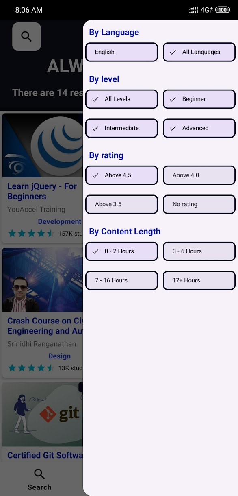
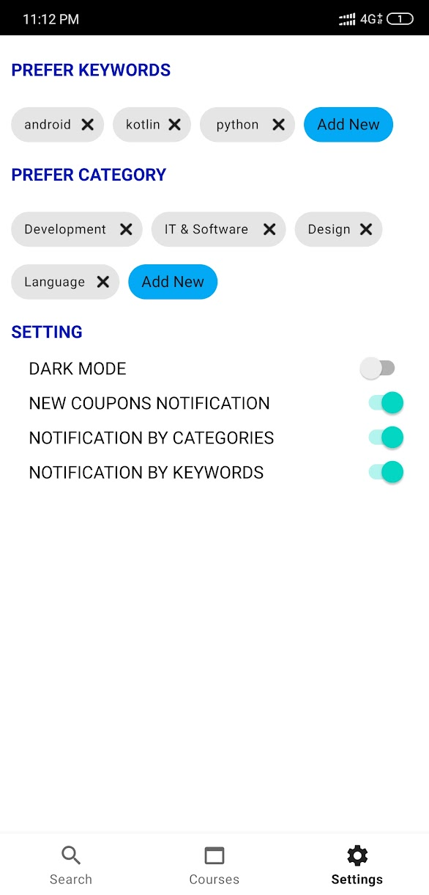

# 100% Udemy Sale-Off Courses Android App

This Android app allows users to access 100% sale-off Udemy courses for free. All courses are fetched from a server and displayed in a list. Users can filter and search for courses, view detailed information about each course, and enroll in courses through an embedded web view. The app also allows users to view a list of all enrolled courses.

# Download
Go to the [releases page](https://github.com/Huythanh0x/AndroidUdemyCoupon/releases) to download the latest available apk.

# Data source

Get in to [Data source](https://github.com/Huythanh0x/UdemyCouponKtorServer) to know about this API

# Screeenshot

  
  
  

  
  
  

  
  
  

# Features 

- [x] New coupons
- [x] Coupon search
- [x] Coupon filter
- [x] Detailed info
- [x] Preview videos
- [x] Share as text and open in browser
- [x] Enroll the course (web view)
- [x] Enroll courses (web view)
- [ ] Notification
- [ ] Dark mode

# Development Roadmap

- [x] [Kotlin](https://kotlinlang.org/)
- [x] [LiveData](https://developer.android.com/topic/libraries/architecture/livedata)
- [x] [Navigation](https://developer.android.com/topic/libraries/architecture/navigation)
- [x] [ViewModel](https://developer.android.com/topic/libraries/architecture/viewmodel)
- [x] [Room](https://developer.android.com/topic/libraries/architecture/room)
- [x] [Datastore](https://developer.android.com/topic/libraries/architecture/datastore)
- [x] [Coroutines](https://developer.android.com/topic/libraries/architecture/coroutines)
- [x] [Databinding](https://developer.android.com/topic/libraries/data-binding)
- [x] [Retrofit](https://square.github.io/retrofit/)
- [x] [Hilt](https://developer.android.com/training/dependency-injection/hilt-android)
- [x] [MotionLayout](https://developer.android.com/develop/ui/views/animations/motionlayout)
- [ ] JUnit
- [ ] Transition Animations
- [ ] [Jetpack Compose](#)